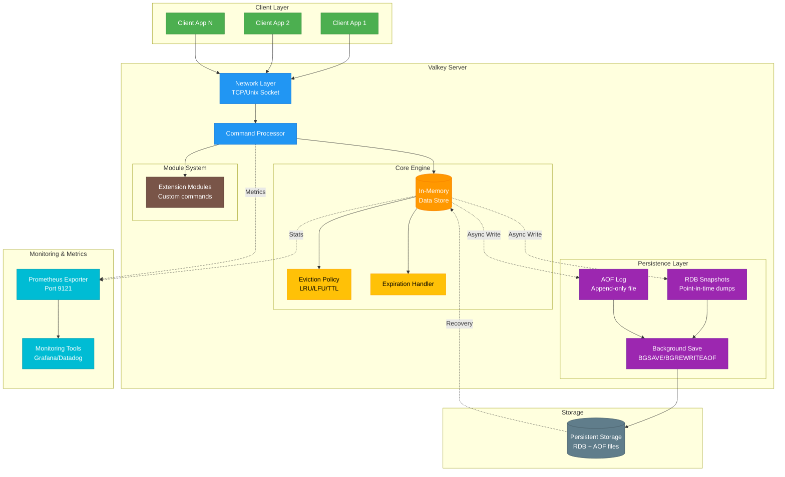
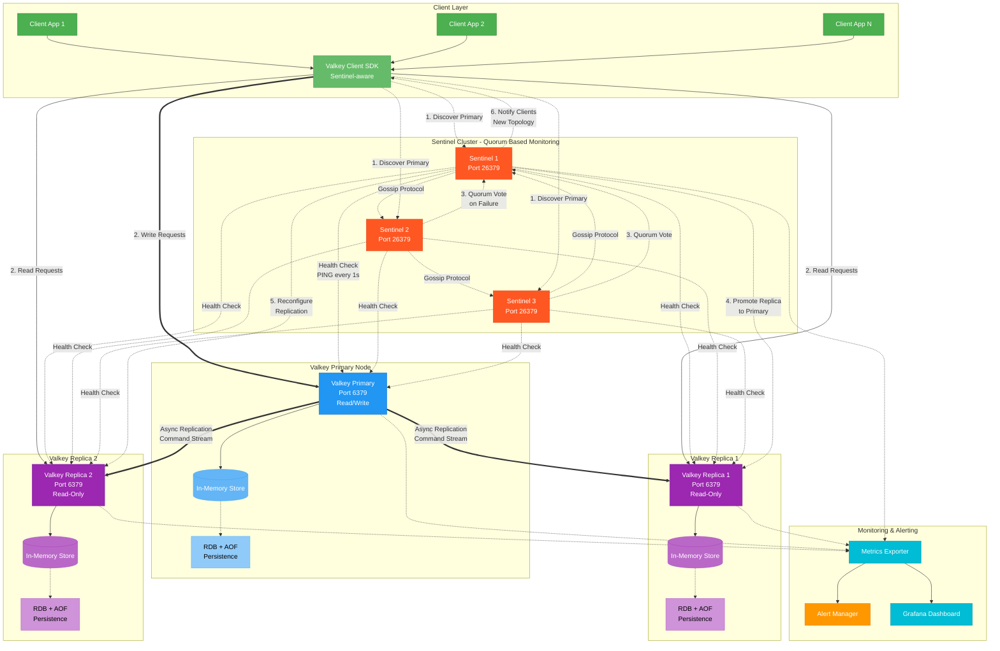

# Valkey Architecture Diagrams

This document provides comprehensive architecture diagrams for Valkey in both standalone and Sentinel modes.

## Table of Contents

- [Valkey Architecture Diagrams](#valkey-architecture-diagrams)
  - [Table of Contents](#table-of-contents)
  - [Valkey Standalone Architecture](#valkey-standalone-architecture)
    - [Standalone Mode Components](#standalone-mode-components)
  - [Valkey Sentinel Mode Architecture (High Availability)](#valkey-sentinel-mode-architecture-high-availability)
    - [Sentinel Mode Components](#sentinel-mode-components)
  - [Sentinel Failover Sequence](#sentinel-failover-sequence)
    - [Failover Process (6 Steps)](#failover-process-6-steps)
  - [Key Features](#key-features)
    - [Standalone Mode](#standalone-mode)
    - [Sentinel Mode (High Availability)](#sentinel-mode-high-availability)
    - [Comparison Table](#comparison-table)
    - [Monitoring Recommendations](#monitoring-recommendations)
    - [Security Considerations](#security-considerations)
  - [Additional Resources](#additional-resources)

______________________________________________________________________

## Valkey Standalone Architecture

A single-instance deployment suitable for development, testing, or non-critical workloads.

### Standalone Mode Components

- **Network Layer**: Handles TCP/Unix socket connections
- **Command Processor**: Parses and executes Valkey commands
- **In-Memory Data Store**: Core key-value storage with O(1) operations
- **Eviction Policies**: LRU, LFU, or TTL-based memory management
- **Expiration Handler**: Automatically removes expired keys
- **RDB Snapshots**: Point-in-time binary dumps for backup/recovery
- **AOF Log**: Append-only command log for durability
- **Module System**: Custom commands and data types
- **Prometheus Exporter**: Real-time metrics on port 9121

______________________________________________________________________

## Valkey Sentinel Mode Architecture (High Availability)

Production-ready deployment with automatic failover and high availability.

### Sentinel Mode Components

- **Sentinel Cluster**: 3+ nodes (odd number) for quorum-based decisions
- **Gossip Protocol**: Sentinels communicate via pub/sub
- **Health Monitoring**: PING checks every 1 second
- **Quorum Voting**: Majority agreement required for failover
- **Primary Node**: Handles all write operations
- **Replica Nodes**: Handle read operations, can be promoted
- **Async Replication**: Commands streamed from primary to replicas
- **Sentinel-aware Clients**: Automatically discover current primary
- **Failover Time**: Typically 30-60 seconds

______________________________________________________________________

## Sentinel Failover Sequence

### Failover Process (6 Steps)

1. **Detection**: Sentinels detect primary failure via health checks (5s timeout)
1. **SDOWN → ODOWN**: Subjective down becomes objective down with quorum agreement
1. **Leader Election**: One Sentinel elected to manage failover via voting
1. **Replica Selection**: Best replica chosen based on:
   - Replication offset (lowest lag)
   - Priority configuration
   - Replication ID match
1. **Promotion**: Selected replica promoted to new primary (`SLAVEOF NO ONE`)
1. **Reconfiguration**:
   - Other replicas reconfigured to replicate from new primary
   - Sentinels update their configuration files
   - Clients notified of new topology

______________________________________________________________________

## Key Features

### Standalone Mode

**Advantages:**

- Simple deployment and configuration
- Lower resource overhead (single node)
- Fast performance (no replication overhead)
- Suitable for development/testing

**Limitations:**

- Single point of failure
- No automatic failover
- Downtime during maintenance
- No read scaling

**Best For:**

- Development environments
- Non-critical workloads
- Caching layers with acceptable data loss
- Testing and CI/CD pipelines

### Sentinel Mode (High Availability)

**Advantages:**

- **Automatic Failover**: 30-60 second recovery time
- **High Availability**: 99.9%+ uptime with proper configuration
- **Read Scaling**: Distribute reads across replicas
- **Data Durability**: Multiple copies of data
- **Zero-downtime Maintenance**: Perform maintenance on replicas

**Configuration Requirements:**

- **Minimum 3 Sentinels**: Required for quorum (prevents split-brain)
- **Odd Number of Sentinels**: Ensures clear majority (3, 5, 7, etc.)
- **Geographic Distribution**: Deploy across availability zones
- **Quorum Configuration**: Typically set to `(N/2) + 1` where N = total Sentinels

**Replication:**

- **Asynchronous**: Primary doesn't wait for replica acknowledgment
- **Eventually Consistent**: Small lag (typically \<100ms)
- **Full Resync**: New replicas get full dataset snapshot
- **Partial Resync**: Recovering replicas catch up via backlog

**Best For:**

- Production workloads requiring high availability
- Applications that cannot tolerate extended downtime
- Read-heavy workloads (scale reads with replicas)
- Enterprise deployments

### Comparison Table

| Feature             | Standalone              | Sentinel Mode             |
| ------------------- | ----------------------- | ------------------------- |
| **Availability**    | Single point of failure | 99.9%+ uptime             |
| **Failover**        | Manual                  | Automatic (30-60s)        |
| **Data Durability** | Single copy             | Multiple copies           |
| **Read Scaling**    | No                      | Yes (via replicas)        |
| **Complexity**      | Low                     | Medium                    |
| **Minimum Nodes**   | 1                       | 6 (3 Valkey + 3 Sentinel) |
| **Resource Usage**  | Low                     | Medium-High               |
| **Maintenance**     | Requires downtime       | Zero-downtime possible    |
| **Cost**            | Low                     | Medium                    |

### Monitoring Recommendations

For both modes, monitor these key metrics:

- **Memory Usage**: `used_memory`, `used_memory_rss`, `mem_fragmentation_ratio`
- **Operations**: `instantaneous_ops_per_sec`, `total_commands_processed`
- **Connections**: `connected_clients`, `rejected_connections`
- **Persistence**: `rdb_last_save_time`, `aof_last_rewrite_time`
- **Replication** (Sentinel only): `master_repl_offset`, `slave_repl_offset`, `repl_backlog_size`
- **Sentinel Health**: `sentinel_masters`, `sentinel_sentinels`, `sentinel_running_scripts`

### Security Considerations

- Enable ACLs (Access Control Lists) for authentication
- Use TLS/SSL for encrypted connections
- Do not support legacy `requirepass` for password protection
- Disable dangerous commands (`FLUSHALL`, `CONFIG`, etc.)

______________________________________________________________________

## Additional Resources

- [Valkey Documentation](https://valkey.io/docs/)
- [Valkey Sentinel Guide](https://valkey.io/topics/sentinel/)
- [Valkey Replication](https://valkey.io/topics/replication/)

______________________________________________________________________

**Last Updated**: 2025-10-30
